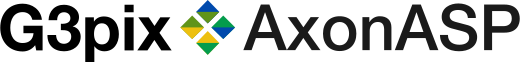

# 🚀 AxonASP 2.0: The Ultimate Classic ASP Engine for the Modern Web

<p align="center">
  
</p>

<p align="center">
  <b> Supercharge your legacy code. Build blazing-fast modern APIs. Experience Classic ASP like never before. </b>
  <br>
  Run your new and legacy ASP Classic applications with modern speed and cross-platform compatibility
</p>

<p align="center">
    
  
  
  
</p>


Welcome to **AxonASP 2.0**, the definitive, high-performance runtime for executing Microsoft Classic ASP and VBScript in GoLang. We didn't just update the engine; we completely reinvented it. 

> [!NOTE]
> **⚠️ Important Notice:** _AxonASP Version 1.0_ is completely **deprecated** and is not compatible with Version 2.0. 
> The architectural leaps we've made mean a clean break from the past to deliver the future of ASP.

If you thought Classic ASP was dead, think again. AxonASP breathes raw power, modern infrastructure compatibility, and incredible new features into the language you know and love. It's time to realize the true potential of your applications!

---

## 🔥 Why AxonASP? The Performance Revolution

We threw out the rulebook to achieve extreme performance improvements that will blow your mind:

*   **Zero AST, Pure Bytecode:** The new compiler is single-pass and emits bytecode directly to a highly optimized, stack-based Virtual Machine. By eliminating the Abstract Syntax Tree (AST), AxonASP executes scripts with virtually zero-allocation overhead. It is insanely fast and memory optimized.
*   **IIS-Style VM Pooling & Advanced Caching:** We've implemented an advanced VM pool modeled perfectly after IIS, combined with aggressive script caching and `eval`/`execute`/`executeglobal` compilation caching. Processing times are phenomenally accelerated.
*   **Standardization meets Innovation:** You get 100% adherence to Classic ASP and VBScript standards, meaning your legacy code drops right in. But we didn't stop there: we added over **60 custom Axon functions**, including advanced array manipulation, to make writing ASP a joy again.
*   **Run ASP Anywhere:** Web server, FastCGI, or the command line! The brand new **CLI with TUI (Text User Interface)** allows you to execute ASP code directly from your terminal. This opens incredible possibilities: run scheduled ASP scripts as background jobs, cron tasks, and powerful system administration tools!
*   **AI-Ready with MCP:** AxonASP includes a built-in Model Context Protocol (MCP) server. AI agents can now connect directly to your runtime, understand your specific environment, and autonomously author complete ASP pages utilizing all available native functions.
*   **Test-Driven ASP:** Say goodbye to broken scripts and regressions. The new `axonasp-testsuite` executable allows you to write and run automated test suites directly against your ASP files natively!
*   **High-Performance JScript (ES5):** AxonASP now includes a dedicated, AST-based JScript engine. Mostly compliant with ECMAScript 5, it supports JavaScript features like `JSON`, `Array.map/filter`, and strict mode, allowing you to modernize your logic while keeping the ASP infrastructure.

---

## 🛠️ What's New in Version 2.0?

*   **Smarter Networking:** The default proxy server port has been changed (now 8801) to intelligently avoid common firewall errors and system port conflicts right out of the box.
*   **Centralized Configuration:** Say hello to `Viper`. Manage your entire server environment from a single, unified `axonasp.toml` configuration file, with simultaneous, drop-in support for `.env` environment variables.
*   **Complete Local Documentation:** Stop endlessly searching the web for old forums. The complete, extensive manual is available right inside the repository at `./www/manual/md/`.
*   **Access Database Converter:** Migrating away from legacy Windows servers? Use the built-in tool at `/www/database-convert/` (Windows only) to easily convert your legacy Access databases to modern formats.
*   **Modern Architecture Templates:** Who says ASP can't be modern? We include complete, working examples for **REST, RESTful, MVC, and MVVM** architectures built purely in high-performance ASP.
*   **Native Docker Support:** Containerize your legacy apps in seconds. Full, production-ready support is provided via the included `Dockerfile` and `docker-compose.yml`.
*   **Extended Functionality**: 60+ custom functions inspired by PHP for enhanced productivity
*   **Database Support**: SQLite, MySQL, PostgreSQL, MS SQL Server, Oracle, Microsoft Access (Windows)

---

## ⚡ Native G3 Libraries: Enterprise Power, Zero Overhead

AxonASP extends Classic ASP with incredibly fast, zero-allocation native Go libraries. Avoid VBScript execution bottlenecks and use these built-in powerhouses:

*   **G3Axon:** Access over 60 custom system, environment, array manipulation, and engine utility functions.
*   **G3Crypto:** Generate hashes (MD5, SHA, Blake2), encrypt data, and generate secure random bytes.
*   **G3JSON:** Parse, build, and stringify JSON data instantly.
*   **G3DB:** High-performance database connectivity with built-in connection pooling.
*   **G3HTTP:** Fetch external APIs and resources via a robust HTTP client.
*   **G3Mail:** Send SMTP emails seamlessly with HTML bodies and file attachments.
*   **G3Image:** Process, draw, manipulate, and convert images (PNG, JPG) on the fly.
*   **G3FILES:** Perform extensive file system operations and encoding conversions safely.
*   **G3TestSuite:** Integrated framework for writing and running automated ASP assertions.
*   **G3Template:** Render dynamic text and HTML templates effortlessly.
*   **G3Zip:** Create, extract, and manage ZIP archives directly from your code.
*   **G3ZLIB:** Stream fast ZLIB compression and decompression.
*   **G3TAR:** Create and extract TAR archives seamlessly.
*   **G3ZSTD:** Utilize ultra-fast Zstandard (ZSTD) compression for maximum performance.
*   **G3FC:** Quickly find files and extract file metadata across complex directories.
*   **G3MD:** Convert Markdown text into clean HTML instantly.
*   **G3PDF:** Generate native PDF documents with text, shapes, and images.
*   **G3FileUploader:** Securely and easily handle multipart form data and file uploads.

*(Check out `./www/manual/menu.md` and `./www/manual/md/` for full API details!)*

---

## 🚀 Quick Deployment & Execution

AxonASP is designed to be built and deployed in seconds, getting your applications online faster than ever.

### Prerequisites
*   GoLang 1.26+ (to build the system binaries)
*   Your existing ASP codebase (or explore our awesome examples in `/www/`)

### Building the Engine
We provide robust, ready-to-use build scripts right in the root directory.

**Windows:**
```powershell
.\build.ps1
```

**Linux / macOS:**
```bash
./build.sh
```

**Experience the absolute pinnacle of Classic ASP execution. Dive into the manual at [./www/manual/md/](www/manual/md/) and start building today!**

### Deployment Architectures: Proxy vs. FastCGI

AxonASP provides total flexibility in how you expose your applications to the world. You have two primary architectural choices:

1.  **Reverse Proxy Mode (`axonasp-http`):** Run AxonASP's built-in web server and place a reverse proxy (like Nginx or Apache) in front of it. The proxy handles TLS/SSL termination, caching static files, and security, while simply forwarding dynamic ASP requests to AxonASP.
2.  **FastCGI Mode (`axonasp-fastcgi`):** Integrate directly with your web server using the FastCGI protocol. This bypasses HTTP overhead between the proxy and the application, providing native integration.

*(Note: Both modes offer the exact same feature parity, except the web.config support which is only available in Reverse Proxy Mode. Choose the one that best fits your infrastructure needs.)*

### Nginx Deployment Examples

**Option A: Using Nginx as a Reverse Proxy**
```nginx
server {
    listen 80;
    server_name myapp.local;

    # Serve static files directly via Nginx for max speed
    location ~* \.(jpg|jpeg|png|gif|ico|css|js)$ {
        root /var/www/axonasp/www;
    }

    # Forward ASP and other dynamic requests to AxonASP HTTP Server
    location / {
        proxy_pass http://127.0.0.1:8801;
        proxy_set_header Host $host;
        proxy_set_header X-Real-IP $remote_addr;
    }
}
```

**Option B: Using Nginx with FastCGI**
```nginx
server {
    listen 80;
    server_name myapp.local;
    root /var/www/axonasp/www;

    # Pass ASP files directly to the AxonASP FastCGI daemon
    location ~ \.asp$ {
        include fastcgi_params;
        fastcgi_pass 127.0.0.1:9000;
        fastcgi_param SCRIPT_FILENAME $document_root$fastcgi_script_name;
    }
}
```

### Apache Deployment Examples

**Option A: Using Apache as a Reverse Proxy**
```apache
<VirtualHost *:80>
    ServerName myapp.local
    DocumentRoot "/var/www/axonasp/www"

    # Serve static assets locally to reduce load
    ProxyPassMatch "^/(.*\.jpg|png|css|js)$" "!"

    # Forward everything else to AxonASP HTTP Server
    ProxyPass / http://127.0.0.1:8801/
    ProxyPassReverse / http://127.0.0.1:8801/
</VirtualHost>
```

**Option B: Using Apache with FastCGI (Requires mod_proxy_fcgi)**
```apache
<VirtualHost *:80>
    ServerName myapp.local
    DocumentRoot "/var/www/axonasp/www"

    # Pass ASP requests to the AxonASP FastCGI daemon
    <FilesMatch "\.asp$">
        SetHandler "proxy:fcgi://127.0.0.1:9000"
    </FilesMatch>
</VirtualHost>
```

---

### Performance

G3Pix AxonASP delivers exceptional performance thanks to GoLang's efficiency:

- **Fast Startup**: Server starts in milliseconds
- **Low Memory Footprint**: Minimal resource consumption
- **Concurrent Request Handling**: Native Go concurrency for handling multiple requests
- **Optimized Parsing**: Efficient VBScript lexer and parser 

---

### Why Choose G3Pix AxonASP?

| Feature | Traditional IIS | G3Pix AxonASP |
|---------|-----------------|---------------|
| **Platform** | Windows only | Windows, Linux, macOS |
| **Performance** | Standard | Accelerated (Go) |
| **Dependencies** | IIS, Windows Server | Single binary |
| **Deployment** | Complex | Simple binary or FastCGI |
| **Database Support** | Windows databases | SQLite, MySQL, PostgreSQL, SQL Server, Oracle, Access |
| **Cost** | Windows licensing | Free & open source |
| **Modernization** | Limited | 60+ extended functions |
| **Container Ready** | Challenging | Docker-friendly |
| **Web Server Integration** | IIS only | nginx, Apache, IIS, Caddy, FastCGI |
| **URL Rewriting** | IIS modules | Built-in web.config support on proxy server |

### 🤝 Contributing

We welcome contributions! Please follow these guidelines:

1. Fork the repository
2. Create a feature branch (`git checkout -b feature/amazing-feature`)
3. Commit your changes (`git commit -m 'Add amazing feature'`)
4. Push to the branch (`git push origin feature/amazing-feature`)
5. Open a Pull Request

### Development Guidelines

- All code, comments, and documentation must be in **English**
- Follow Go best practices and conventions, there is a gemini.md and a copilot-instructions.md to keep code consistent and high quality when using AI assistance.
- Add tests for new features in `www/tests/`
- Update documentation when adding features following the style of existing docs
- Keep commits atomic and descriptive

---

### AI Ready

AxonASP includes a built-in Model Context Protocol (MCP) server that allows AI agents to connect directly to your runtime environment. This enables powerful capabilities such as documentation lookup and ASP code instructions generation directly from your editor or AI assistant. For details on how to connect and use the MCP server, see the [MCP Server and VS Code Integration](www/manual/md/runtime/mcp-vscode.md) documentation.
You can also see an example prompt for using with AI Agents in the [Program Classic ASP with LLMs](www/manual/md/authoring/llm-classic-asp-coding.md) documentation.


---

### License

This project is licensed under the MPL License - see the [LICENSE](LICENSE.txt) file for details.

---

### Support & Community

- **Issues**: [GitHub Issues](https://github.com/guimaraeslucas/axonasp/issues)
- **Discussions**: [GitHub Discussions](https://github.com/guimaraeslucas/axonasp/discussions)
- **Website**: [https://g3pix.com.br/axonasp](https://g3pix.com.br/axonasp)

---

### Acknowledgments

Special thanks to:
- The Go community and Open Source community for all the contribution
- Classic ASP developers who keep legacy applications running
- Contributors and testers who help improve G3Pix AxonASP 

---

<p align="center">
  <strong>Built with ❤️ by G3Pix</strong>
  <br>
  Making Classic ASP modern, fast, and cross-platform
</p>

<p align="center">
  <a href="https://github.com/guimaraeslucas/axonasp">⭐ Star us on GitHub</a>
  •
  <a href="https://github.com/guimaraeslucas/axonasp/issues">🐛 Report Bug</a>
  •
  <a href="https://github.com/guimaraeslucas/axonasp/issues">✨ Request Feature</a>
</p>

---

#### Legal Disclaimer

Third-Party Trademarks and Affiliations
AxonASP is an independent software project developed by G3pix Ltda and is **not affiliated with, endorsed by, or sponsored by Microsoft Corporation** in any way. 

The names "Microsoft," "Active Server Pages," "ASP," and "VBScript,", "Windows", "Office", "Access", "ActiveX" as well as any related names, marks, emblems, and images relative to ASP, are registered trademarks of Microsoft Corporation. The use of these trademarks within this project is purely for descriptive, identification, and reference purposes to indicate technical compatibility, and does not imply any association with the trademark holder.